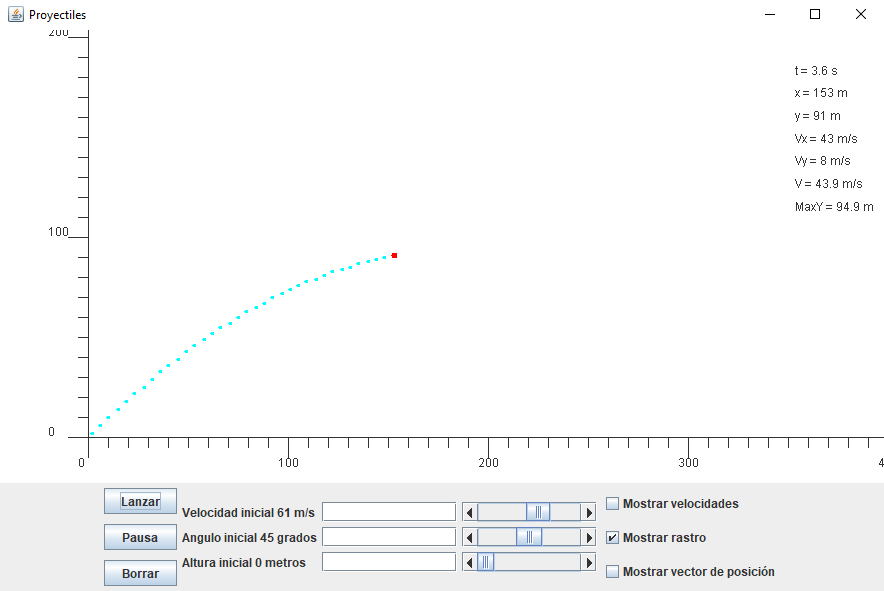

# Projectile simulation

**Program**: https://github.com/oscarjcg/proyectile-java/tree/master/Application
* **Windows**: Standalone
* **Linux**: java -jar Aplicacion.jar

**Description:** Shooting game with balls

**Features**:
* 'Lanzar': Shoot projectile
* 'Pausa': Pause simulation
* 'Borrar': Delete trayectory
* 'Mostrar rastro': Trayectory
* MVC

**Development environment**:
* **OS:** Linux
* **Java:** 1.8.0_121  
* **Eclipse**: Neon